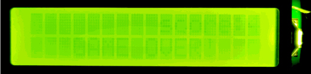
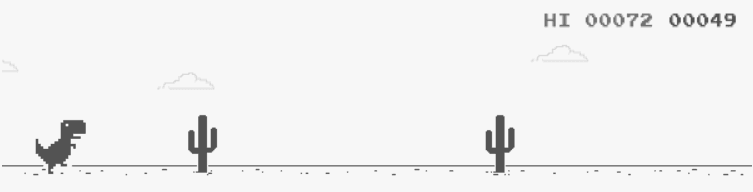
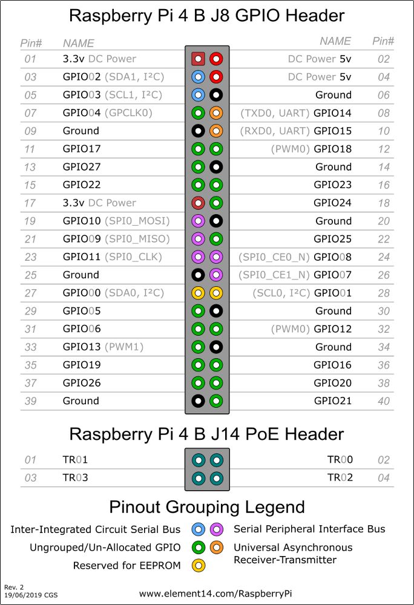
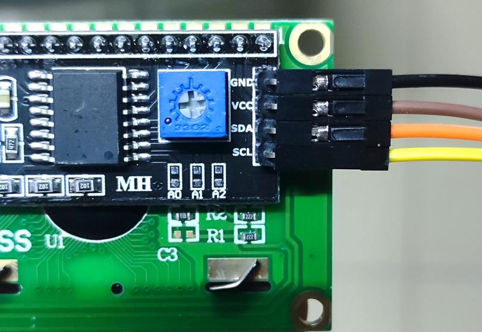
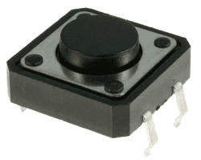
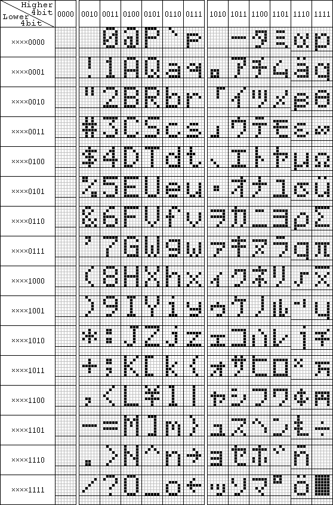
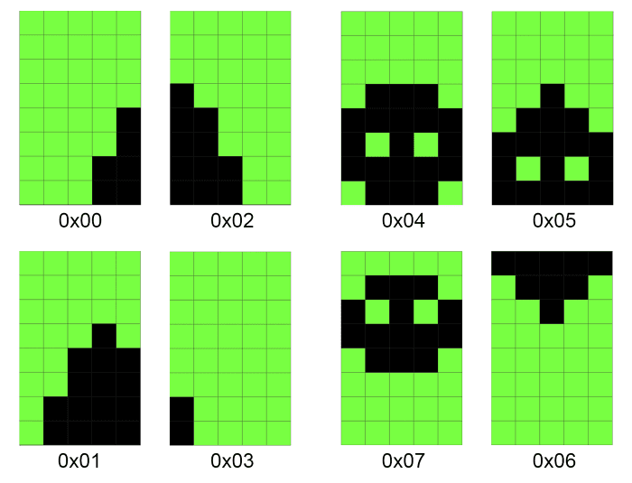

# chrome-dino-game-lcd1602-raspberrypi

Chrome dinosaur game on LCD1602, Raspberry Pi 4 Model B.



## Inspiration

Who hasn't played the dinosaur game in Chrome when network disconnected? But how about on LCD1602, Raspberry Pi?



References:
- [Arduino 1602 Snake](https://github.com/SadaleNet/Arduino1602Snake)
- [Raspberry Pi LCD Runner](https://github.com/Blueve/RaspberryPiLCDRunner)

## How to play

### 1.Connect to LCD1602

Raspberry Pi (model 4B) has 40 GPIO pins in total, stacked in 20 x 2 array.



The LCD1602 on its own is quite tricky to wire it up since it requires 16 pins to be connected. The LCD1602 can also be purchased with an I2C module, which reduces the amount of pins needed to just 4.



Connect to LCD1602:

- GND <---> Ground
- VCC <---> 5V
- SDA <---> GPIO2(SDA)
- SCL <---> GPIO3(SCL)

### 2.Connect to Button.

Common PCB button has 4 pins in pairs. Two pins in the same pair are always connected. When the button is pressed, the pins are all connected. We only use 2 pins that are not in the same pair. We call them BTN1, BTN2. Logically, they are the same, so there's no need to worry about order.



Connect to Button:

- BTN1 <---> Ground
- BTN2 <---> GPIO17

### 3.Install dependencies

If you have already installed them before, skip to step 4.

```
sudo apt-get install -y python-smbus
sudo apt-get install -y i2c-tools
```
### 4.Enable I2C interface

If you have already enabled it before, skip to step 5.

```
sudo raspi-config
```

Different Raspberry Pi models have slightly different menu. It's easy to find how to enable I2C interface on your machine.

### 5.Run dinogame.py

```
sudo python3 dinogame.py
```

[demonstration.mp4](./demo.mp4)

## Design

LCD1602 supports up to 8 custom characters, which means we can only use `0x00 ~ 0x07` in the sheet below.



By carefully defining those 8 characters, it's possible to do animation of 2 kinds of objects: Grass(Obstacle) and Person.



LCD1602 has 2 rows, 16 cols. That is to say, 32 display positions in total. In one of the position, if we display `0x00`, `0x01`, `0x02`, `0x03` in order, we would see grass pass by. Similarly, we can do animation of jumping by carefully arranging the order in which `0x04 ~ 0x07` appear.
