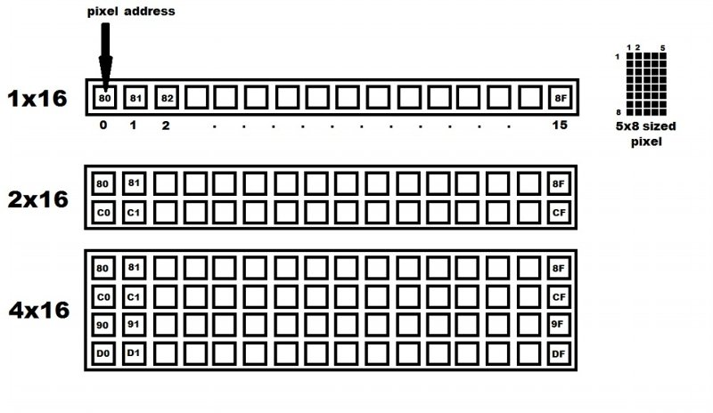
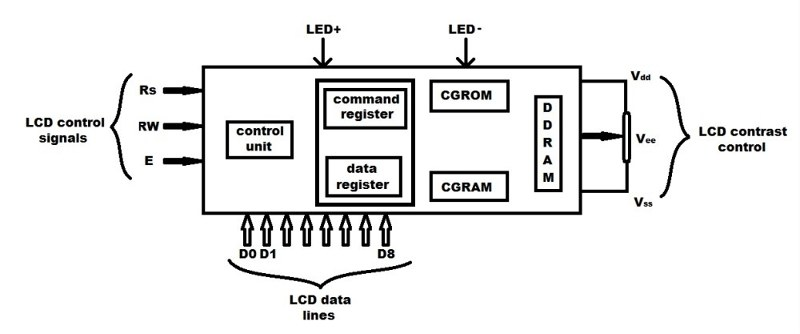

# chrome-dino-game-lcd1602-raspberrypi

Chrome dinosaur game on LCD1602, Raspberry Pi 4 Model B.


[TOC]

## Inspiration

Who hasn't played the dinosaur game in Chrome when network disconnected? But how about on LCD1602, Raspberry Pi?


References:
- [Arduino 1602 Snake](https://github.com/SadaleNet/Arduino1602Snake)
- [Raspberry Pi LCD Runner](https://github.com/Blueve/RaspberryPiLCDRunner)
- [Drive LCD1602 by I2C interface on Raspberry Pi](https://shumeipai.nxez.com/2020/06/17/raspberry-pi-drives-lcd1602-screen-through-i2c.html)

## How to play

### 1.Connect to LCD1602

Raspberry Pi (model 4B) has 40 GPIO pins in total, stacked in 20 x 2 array.


The LCD1602 on its own is quite tricky to wire it up since it requires 16 pins to be connected. The LCD1602 can also be purchased with an I2C module, which reduces the amount of pins needed to just 4.


Connect to LCD1602:

- GND <---> Ground
- VCC <---> 5V
- SDA <---> GPIO2(SDA)
- SCL <---> GPIO3(SCL)

### 2.Connect to Button.

Common PCB button has 4 pins in pairs. Two pins in the same pair are always connected. When the button is pressed, the pins are all connected. We only use 2 pins that are not in the same pair. We call them BTN1, BTN2. Logically, they are the same, so there's no need to worry about order.


Connect to Button:

- BTN1 <---> Ground
- BTN2 <---> GPIO17

### 3.Install dependencies

If you have already installed them before, skip to step 4.

```
sudo apt-get install -y python-smbus
sudo apt-get install -y i2c-tools
```
### 4.Enable I2C interface

If you have already enabled it before, skip to step 5.

```
sudo raspi-config
```

Different Raspberry Pi models have slightly different menu. It's easy to find how to enable I2C interface on your machine.

### 5.Run dinogame.py

```
sudo python3 dinogame.py
```

[demonstration.mp4](./demo.mp4)

## Game design

LCD1602 supports up to 8 custom characters, which means we can only use `0x00 ~ 0x07` in the sheet below.


By carefully defining those 8 characters, it's possible to do animation of 2 kinds of objects: Grass(Obstacle) and Person.


LCD1602 has 2 rows, 16 cols. That is to say, 32 display positions in total. In one of the position, if we display `0x00`, `0x01`, `0x02`, `0x03` in order, we would see grass pass by. Similarly, we can do animation of jumping by carefully arranging the order in which `0x04 ~ 0x07` appear.

### `grass_status` and `jump_status`

We use `grass_status`(list) to record grass status in each position. 0 means empty, it's the initial status:

```python
def game_status_init():
    global grass_status
    global grass_old_status
    global jump_status
    global jump_old_status
    global jump_order
    global game_start
    global score
    global score_old

    grass_status = [0] * COL
    grass_old_status = [0] * COL
    jump_status = 0
    jump_old_status = 0
    jump_order = False
    game_start = False
    score = 0
    score_old = 0
```

New grass always comes from the rightmost postion:

```python
# new grass coming!
if get_grass_age() > 8 and random.random() > 0.9:
    grass_status[-1] = 1
```

How does the grass move?

```python
# For each grass_status[i], its loop is 0 -> 1 -> 2 -> 3 -> 4 -> 0
#
# [0, 0, 0, 0, 0, 0, 0, 0, 0, 0, 0, 0, 0, 0, 0, 0]
# [0, 0, 0, 0, 0, 0, 0, 0, 0, 0, 0, 0, 0, 0, 0, 1]
# [0, 0, 0, 0, 0, 0, 0, 0, 0, 0, 0, 0, 0, 0, 0, 2]
# [0, 0, 0, 0, 0, 0, 0, 0, 0, 0, 0, 0, 0, 0, 1, 3]
# [0, 0, 0, 0, 0, 0, 0, 0, 0, 0, 0, 0, 0, 0, 2, 4]
# [0, 0, 0, 0, 0, 0, 0, 0, 0, 0, 0, 0, 0, 1, 3, 0]
# [0, 0, 0, 0, 0, 0, 0, 0, 0, 0, 0, 0, 0, 2, 4, 0]
# [0, 0, 0, 0, 0, 0, 0, 0, 0, 0, 0, 0, 1, 3, 0, 0]
#
# ...
#
# [0, 0, 0, 1, 3, 0, 0, 0, 0, 0, 0, 0, 0, 0, 0, 0]
# [0, 0, 0, 2, 4, 0, 0, 0, 0, 0, 0, 0, 0, 0, 0, 1]
# [0, 0, 1, 3, 0, 0, 0, 0, 0, 0, 0, 0, 0, 0, 0, 2]
# [0, 0, 2, 4, 0, 0, 0, 0, 0, 0, 0, 0, 0, 0, 1, 3]
# [0, 1, 3, 0, 0, 0, 0, 0, 0, 0, 0, 0, 0, 0, 2, 4]
# [0, 2, 4, 0, 0, 0, 0, 0, 0, 0, 0, 0, 0, 1, 3, 0]
# [1, 3, 0, 0, 0, 0, 0, 0, 0, 0, 0, 0, 0, 2, 4, 0]
# [2, 4, 0, 0, 0, 0, 0, 0, 0, 0, 0, 0, 1, 3, 0, 0]
# [3, 0, 0, 0, 0, 0, 0, 0, 0, 0, 0, 0, 2, 4, 0, 0]
# [4, 0, 0, 0, 0, 0, 0, 0, 0, 0, 0, 1, 3, 0, 0, 0]
# [0, 0, 0, 0, 0, 0, 0, 0, 0, 0, 0, 2, 4, 0, 0, 0]
```

Similarly, we record jump status in `jump_status`. We update them in each loop:

```python
update_grass_status()
update_jump_status()
```

### `grass_old_status` and `jump_old_status`

In each loop, we compare new status with old status and only show the difference. This strategy has great influence on frame rate, since changing single character on LCD1602 takes approximately 0.01s at least and if we always change 16 characters(this takes 0.16s) in each loop, the frame rate can't be higher than 6.25.

There are only 2 obstacles most of the time, so we only need to change about 7 characters in each loop and the frame rate can be about 15, high enough for this simple game.

## I2C Protocol

The Inter-Integrated Circuit (I2C) Protocol is a protocol intended to allow multiple "peripheral" digital integrated circuits ("chips") to communicate with one or more "controller" chips. Like the Serial Peripheral Interface (SPI), it is only intended for short distance communications within a single device. Like Asynchronous Serial Interfaces (such as RS-232 or UARTs), it only requires two signal wires to exchange information.

Communication via I2C is more complex than with a UART or SPI solution. The signalling must adhere to a certain protocol for the devices on the bus to recognize it as valid I2C communications. Fortunately, most devices take care of all the fiddly details for you, allowing you to concentrate on the data you wish to exchange.

### Basics

Messages are broken up into two types of frame: an address frame, where the controller indicates the peripheral to which the message is being sent, and one or more data frames, which are 8-bit data messages passed from controller to peripheral or vice versa. Data is placed on the SDA line after SCL goes low, and is sampled after the SCL line goes high. The time between clock edge and data read/write is defined by the devices on the bus and will vary from chip to chip.


### Start Condition

To initiate the address frame, the controller device leaves SCL high and pulls SDA low. This puts all peripheral devices on notice that a transmission is about to start. If two controllers wish to take ownership of the bus at one time, whichever device pulls SDA low first wins the race and gains control of the bus. It is possible to issue repeated starts, initiating a new communication sequence without relinquishing control of the bus to other controller(s); we'll talk about that later.

### Address Frame

The address frame is always first in any new communication sequence. For a 7-bit address, the address is clocked out most significant bit (MSB) first, followed by a R/W bit indicating whether this is a read (1) or write (0) operation.

The 9th bit of the frame is the NACK/ACK bit. This is the case for all frames (data or address). Once the first 8 bits of the frame are sent, the receiving device is given control over SDA. If the receiving device does not pull the SDA line low before the 9th clock pulse, it can be inferred that the receiving device either did not receive the data or did not know how to parse the message. In that case, the exchange halts, and it's up to the controller of the system to decide how to proceed.

### Data Frames

After the address frame has been sent, data can begin being transmitted. The controller will simply continue generating clock pulses at a regular interval, and the data will be placed on SDA by either the controller or the peripheral, depending on whether the R/W bit indicated a read or write operation. The number of data frames is arbitrary, and most peripheral devices will auto-increment the internal register, meaning that subsequent reads or writes will come from the next register in line.

### Stop condition

Once all the data frames have been sent, the controller will generate a stop condition. Stop conditions are defined by a 0->1 (low to high) transition on SDA after a 0->1 transition on SCL, with SCL remaining high. During normal data writing operation, the value on SDA should not change when SCL is high, to avoid false stop conditions.

## LCD1602 module



Picture above shows that each LCD have its own pixel rows and columns like 1×16 has single raw and sixteen columns i.e. 16 pixel and each pixel size is of 5×8 as shown but we can see only 5×7 cause last raw is used by cursor.

Each character is display according to these pixels size.



Rs -> Register select
Rs=1 mean data register is selected.
Rs=0 mean command register is selected.

RW -> Read/Write
RW=1 mean reading from LCD module.
RW=0 mean writing to LCD module.

EN -> Enable
EN= high to low ( Logic ‘1’ delay Logic ‘0’ ) for use LCD module .

### How are characters displayed

There are three memories in LCD to manipulate display characters:

1. CGROM – character generating ROM which is responsible for stored standard character pattern.
2. CGRAM – character generating RAM which holds custom character pattern space ( total 8 in 2×16 module).
3. DDRAM – data display RAM which stores ASCII codes.

Steps to understand how character display:

1. Control unit of LCD receives signal(basically it is ASCII code) from user and ask to DDRAM for its match.
2. If ASCII code match, control unit maps corresponding character pattern from CGROM.
3. According to that character pattern,  LCD screen energies and we can see character on it.

### LCD1602 commands

In `LCD1602.py`, we implemented two important method, `print_str` and `print_num`.

```python
def write_word(addr, data):
    global BLEN
    temp = data
    if BLEN == 1:
        temp |= 0x08
    else:
        temp &= 0xF7
    BUS.write_byte(addr, temp)

def send_command(comm):
    # Send bit7-4 firstly
    buf = comm & 0xF0
    buf |= 0x04  # RS = 0, RW = 0, EN = 1
    write_word(LCD_ADDR, buf)
    time.sleep(0.002)
    buf &= 0xFB  # Make EN = 0
    write_word(LCD_ADDR, buf)

    # Send bit3-0 secondly
    buf = (comm & 0x0F) << 4
    buf |= 0x04  # RS = 0, RW = 0, EN = 1
    write_word(LCD_ADDR, buf)
    time.sleep(0.002)
    buf &= 0xFB  # Make EN = 0
    write_word(LCD_ADDR, buf)

def send_data(data):
    # Send bit7-4 firstly
    buf = data & 0xF0
    buf |= 0x05  # RS = 1, RW = 0, EN = 1
    write_word(LCD_ADDR, buf)
    time.sleep(0.002)
    buf &= 0xFB  # Make EN = 0
    write_word(LCD_ADDR, buf)

    # Send bit3-0 secondly
    buf = (data & 0x0F) << 4
    buf |= 0x05  # RS = 1, RW = 0, EN = 1
    write_word(LCD_ADDR, buf)
    time.sleep(0.002)
    buf &= 0xFB  # Make EN = 0
    write_word(LCD_ADDR, buf)

def print_str(x, y, str):
    addr = 0x80 + 0x40 * y + x
    send_command(addr)

    for chr in str:
        send_data(ord(chr))

def print_num(x, y, num):
    addr = 0x80 + 0x40 * y + x
    send_command(addr)
    send_data(num)
```

This is based on LCD1602 commands shown in the table below:

| Code (Hex) | Meaning                                  |
| ---------- | ---------------------------------------- |
| 1          | Clear display screen                     |
| 2          | Return home                              |
| 4          | Decrement cursor (shift cursor to left)  |
| 6          | Increment cursor (shift cursor to right) |
| 5          | Shift display right                      |
| 7          | Shift display left                       |
| 8          | Display off, cursor off                  |
| A          | Display off, cursor on                   |
| C          | Display on, cursor off                   |
| E          | Display on, cursor blinking              |
| F          | Display on, cursor blinking              |
| 10         | Shift cursor position to left            |
| 14         | Shift cursor position to right           |
| 18         | Shift the entire display to the left     |
| 1C         | Shift the entire display to the right    |
| 80         | Force cursor to beginning to 1st line    |
| C0         | Force cursor to beginning to 2nd line    |
| 38         | 2 lines and 5×7 matrix (8-bit mode)      |
| 28         | 2 lines and 5×7 matrix (4-bit mode)      |
